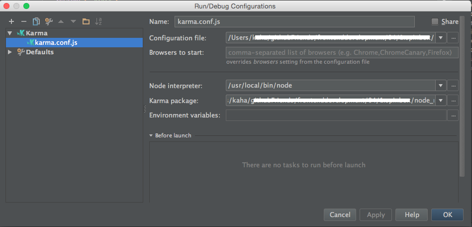

# Karma

http://karma-runner.github.io/0.12/index.html

2012년 구글의 소프트웨어 엔진이어로 근무하던 보이타 지나(Vojta Jina)가 AngularJS를 사용하면서 더 편리하게 테스트 할 수 이쓴 환경을 만들려고 Testacular를 개발했고 오픈 소스화 했다. Testacular는 매우 가벼우며 Node.js Socket.IO를 이용해서 자바스크립트 소스를 감시하고 수정할 때마다 자동으로 테스트를 해주고 테스트의 결과를 브라우저에 실시간으로 보여준다.

Testacular가 프로젝트명이 Karma로 바뀌면서 개발자들에게는 Karma라는 이름으로 알려졌다.

Karma는 테스트 실행환경으로 테스트 프레임워크인 Jasmine, Mocha, QUnit등의 테스트 코드를 사용 할 수 있다.

당신의 프로젝트에 Karma를 설치하기 위해서는 아래의 순서대로 따라하면 된다.
(본 프로젝트는 nodejs 및 npm을 기본으로 사용한다는 가정하에 설명하는 것입니다.)

## package.json 파일생성

프로젝트 폴더에서 `npm init`를 실행하게 되면 아래와 같이 name, version etc 등을 물어 보면 내용과 본인의 프로젝트 성격에 맞게 적어주면 package.json 파일이 생성 됩니다.

```cmd
$> npm init
```

package.json

```cmd
{
  "name": "ProjectName",
  "version": "0.0.1",
  "description": "Javascript  module",
  "main": "index.js",
  "directories": {
    "test": "test"
  },
  "scripts": {
    "test": "node_modules/karama/bin/karma start"
  },
  "author": "",
  "license": "MIT"
}
```

## 테스트 프레임워크 설치

설치되는 karma를 package.json 파일의 devDependencies 속성에 등록하기 위해서는 `--save-dev` 옵션을 적어주고 `npm install --save-dev karma` 명령어를 실행해 주시기 바랍니다.

```cmd
$> npm install --save-dev karma
$> npm install --save-dev qunit
```

pacakge.json 파일 확인

```cmd
{
  ... 생략 ...
  "scripts": {
    "test": "node_modules/karama/bin/karma start"
  },
  "author": "",
  "license": "MIT",
  "devDependencies": {
    "karma": "^0.12.28",
    "qunitjs": "^1.16.0"
  }
}
```

karma를 실행하려면 karma의 configuration 파일`karma.conf.js`을 생성해야 합니다.

아래와 같이 실행하면 몇가지 질문을 하게 되는 데 아래의 요약을 참고하세요.

```cmd
$> $ProjectFolder/node_modules/karma/bin/karma init
```

```cmd
MacPro:1.spinbox kaha$ ./node_modules/karma/bin/karma init

Which testing framework do you want to use ?
Press tab to list possible options. Enter to move to the next question.
> qunit ['jasmine, mocha, qunit etc']

Do you want to use Require.js ?
This will add Require.js plugin.
Press tab to list possible options. Enter to move to the next question.
> no

Do you want to capture any browsers automatically ?
Press tab to list possible options. Enter empty string to move to the next question.
> Chrome
> Safari
> 

What is the location of your source and test files ?
You can use glob patterns, eg. "js/*.js" or "test/**/*Spec.js".
Enter empty string to move to the next question.
> bower_components/jquery/dist/jquery.min.js
> test/**/*.js
> src/**/*.js
> 

Should any of the files included by the previous patterns be excluded ?
You can use glob patterns, eg. "**/*.swp".
Enter empty string to move to the next question.
> 

Do you want Karma to watch all the files and run the tests on change ?
Press tab to list possible options.
> no


Config file generated at "$Project/karma.conf.js".

pacakge.json 파일 확인

```cmd
{
  ... 생략 ...
  "scripts": {
    "test": "node_modules/karama/bin/karma start"
  },
  "author": "",
  "license": "MIT",
  "devDependencies": {
    "karma": "^0.12.28",
    "karma-chrome-launcher": "^0.1.7",
    "karma-firefox-launcher": "^0.1.3",
    "karma-safari-launcher": "^0.1.1",
    "karma-qunit": "^0.1.4",
	"qunitjs": "^1.16.0"
  }
}
```

## 테스트 코드작성

링크를 통해 해당사이트에서 사용법을 참조하고, 자신이 좋아하는 테스트 프레임워크의 테스트 코드를  test 폴더 밑에 작성해 주면됩니다.

* [jasmine](http://jasmine.github.io/) : BDD 지원 테스트 프레임워크
* [mocha](http://mochajs.org/)  : TDD and BDD 지원 테스트 프레임워크
* [QUnit](http://qunitjs.com/)  : JQuery개발자로 알려진 존레시(John Resig)와 존 제프러(Jorn Zaefferer)가 JQuery를 테스트 하기 위해 만든 테스트 프레임워크

## UI 테스트

UI 테스트를 하기 위해서는 `karma-html2js-preprocessor` 모듈을 사용해 HTML 파일이 로드 되도록 테스트 코드를 작성합니다.

```cmd
$> npm install --save-dev karma-html2js-preprocessor
```

## Coverage 커버리지

테스트 할 때 제품 코드를 테스트 코드로 얼마나 커버하고 있는지 즉, 얼마나 테스트로 검증하고 있는지를 수치로 나타낸 것을 말합니다.

```cmd
$> npm install --save-dev karma-coverage
```

## karma.conf.js & package.json

위의 모든 내용을 적용한  karma.config.js 파일과 package.json 파일입니다.

karma.config.js

```javascript
module.exports = function(config) {
  config.set({

    // base path that will be used to resolve all patterns (eg. files, exclude)
    basePath: '',
    
    // frameworks to use
    // available frameworks: https://npmjs.org/browse/keyword/karma-adapter
    frameworks: ['qunit'],

    // list of files / patterns to load in the browser
    files: [
      'bower_components/jquery/dist/jquery.min.js',
      'test/**/*.html',
      'test/**/*.js',
      'src/**/*.js'
    ],

    // list of files to exclude
    exclude: [
    ],

    // preprocess matching files before serving them to the browser
    // available preprocessors: https://npmjs.org/browse/keyword/karma-preprocessor
    preprocessors: {
      'test/**/*.html':['html2js'],
      'src/**/*.js':['coverage']
    },

    // test results reporter to use
    // possible values: 'dots', 'progress'
    // available reporters: https://npmjs.org/browse/keyword/karma-reporter
    reporters: ['progress','coverage'],

    // web server port
    port: 9876,

    // enable / disable colors in the output (reporters and logs)
    colors: true,

    // level of logging
    // possible values: config.LOG_DISABLE || config.LOG_ERROR || config.LOG_WARN || config.LOG_INFO || config.LOG_DEBUG
    logLevel: config.LOG_INFO,

    // enable / disable watching file and executing tests whenever any file changes
    autoWatch: false,

    // start these browsers
    // available browser launchers: https://npmjs.org/browse/keyword/karma-launcher
    // browsers: ['Chrome', 'Safari'],
    browsers: ['Chrome'],

    // Continuous Integration mode
    // if true, Karma captures browsers, runs the tests and exits
    singleRun: false
  });
};

```

package.json

```json
{
  "name": "ProjectName",
  "version": "0.0.1",
  "description": "Javascript  module",
  "main": "index.js",
  "directories": {
    "test": "test"
  },
  "scripts": {
    "test": "node_modules/karama/bin/karma start"
  },
  "author": "",
  "license": "MIT",
  "devDependencies": {
    "karma": "^0.12.28",
    "karma-chrome-launcher": "^0.1.7",
    "karma-coverage": "^0.2.7",
    "karma-firefox-launcher": "^0.1.3",
    "karma-html2js-preprocessor": "^0.1.0",
    "karma-qunit": "^0.1.4",
    "karma-safari-launcher": "^0.1.1",
    "qunitjs": "^1.16.0"
  }
}
```

##  webstorm에 적용하기

Run > Edit Configurations... > '+' 클릭 > karma 선택



### webstorm Run Test & Run Test Coverage

Run ... & Run 'karma.config.js' with Converage 를 클릭해서 테스트 및 테스트 커버리지를 실행한다.


