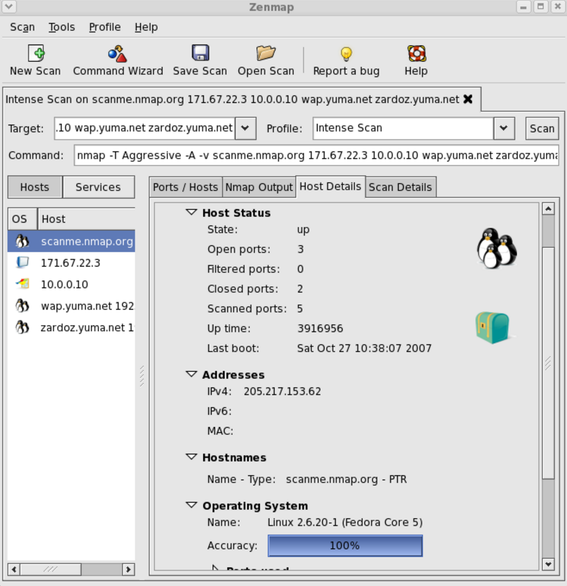

# nmap

NMAP은 port Scanning 툴로서 호스트나 네트워크를 스캐닝 할 때, 아주 유용한 시스템 보안툴인 동시에, 해커에게는 강력한 해킹툴 입니다.

### 개요

서버를 운영하다 보면 관리자 스스로도 어떤 포트가 열려있고, 또 어떤 서비스가 제공중인지 잘 모를때가 있습니다. 기억력이 나빠서나, 게을러서가 아니라 필요에 의해 자주 변경되므로 수시로 파악해서 기록해두지 않으면 잊어버리게 됩니다. 또 크래킹에 의해 생성된 백도어는 파악하기가 어렵습니다.

수 많은 포트와 서비스를 효과적으로 체크해서 관리하기 위해서 NMAP과 같은 포트 스캔 툴이 필요합니다. 

NMAP은 기존의 포트스캔툴에 비해 다양한 옵션과 방화벽 안쪽의 네트웍도 스캔할 수 있는 강력한 기능이 있습니다.

### mac에 설치하기

brew 를 이용한 설치가 가능 합니다.
```consoles
$> brew install nmap
```

### 대표적인 명령어
**-sT**	일반적인 TCP 포트스캐닝.
**-sS**	이른바 'half-open' 스캔으로 추적이 어렵다.
**-sP**	ping 을 이용한 일반적인 스캔.
**-sU**	UDP 포트 스캐닝.
**-PO**	대상 호스트에 대한 ping 응답을 요청하지 않음 .
**log** 기록과 filtering 을 피할 수 있다.
**-PT**	일반적이 ICMP ping이 아닌 ACK 패킷으로 ping 을 보내고
**RST** 패킷으로 응답을 받는다.
**-PI**	일반적인 ICMP ping 으로 방화벽이나 필터링에 의해 걸러진다.
**-PB**	ping 을 할 때 ICMP ping 과 TCP ping을 동시에 이용한다.
**-PS**	ping 을 할 때 ACK 패킷대신 SYN 패킷을 보내 스캔.
**-O**	대상 호스트의 OS 판별.
**-p**	대상 호스트의 특정 포트를 스캔하거나, 스캔할 포트의 범위를 지정. ex) -p 1-1024
**-D**	Decoy 기능으로 대상 호스트에게 스캔을 실행한 호스트의 주소를 속인다.
**-F**	/etc/services 파일 내에 기술된 포트만 스캔.
**-I**	TCP 프로세서의 identd 정보를 가져온다.
**-n**	IP 주소를 DNS 호스트명으로 바꾸지 않는다. 속도가 빠르다.
**-R**	IP 주소를 DNS 호스트명으로 바꿔서 스캔. 속도가 느리다.
**-o**	스캔 결과를 택스트 파일로 저장.
**-i**	스캔 대상 호스트의 정보를 지정한 파일에서 읽어서 스캔.
**-h**	도움말 보기

예제)
```
$> nmap -sT XXX.XXX.XXX
Nmap scan report for 152.149.XXX.XXX
Host is up (0.011s latency).
Not shown: 997 filtered ports
PORT     STATE  SERVICE
80/tcp   open   http
8010/tcp open   xmpp
8080/tcp closed http-proxy
```

### 그외 윈도우용 nmap

[윈도우즈용 namp 내려받기](https://nmap.org/book/inst-windows.html)

