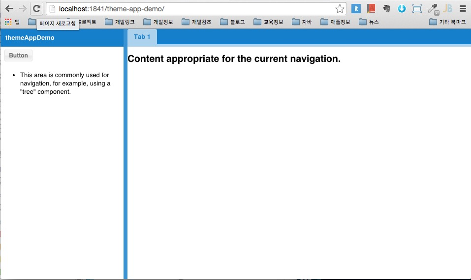
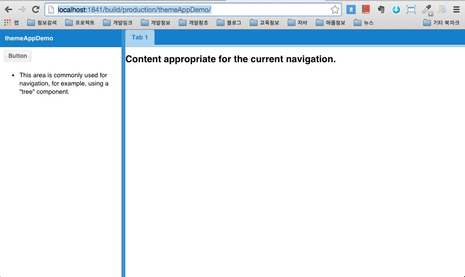

## Sencha Cmd 사용법

### 1. Sencha SDK로 프로젝트 생성하기

```cmd
Sencha -sdk [ ExtJs SDK 경로명 ] generate app  extjs4 [ 생성할 APP 경로명 ]
```

```cmd
$ sencha -sdk ~/WorkSpace/SenchaStudy/ext-4.2.1/ generate app extjs4 ~/WorkSpace/extjs4

$ls -la
total 176
drwxr-xr-x  20 seokangchun  staff    680 10 22 17:36 .
drwxr-xr-x  12 seokangchun  staff    408 10 22 19:14 ..
drwxr-xr-x   4 seokangchun  staff    136 10 22 15:13 .sencha
-rw-r--r--   1 seokangchun  staff   1283 10 22 15:13 Readme.md
drwxr-xr-x   8 seokangchun  staff    272 10 22 15:29 app
-rw-r--r--   1 seokangchun  staff    607 10 22 16:48 app.js
-rw-r--r--   1 seokangchun  staff    104 10 22 15:13 app.json
-rw-r--r--   1 seokangchun  staff    303 10 22 17:36 bootstrap.css
-rw-r--r--   1 seokangchun  staff  50873 10 22 17:36 bootstrap.js
-rw-r--r--   1 seokangchun  staff    282 10 22 17:36 bootstrap.json
drwxr-xr-x   5 seokangchun  staff    170 10 22 17:36 build
-rw-r--r--   1 seokangchun  staff   1469 10 22 15:13 build.xml
drwxr-xr-x  28 seokangchun  staff    952 10 22 15:13 ext
-rw-r--r--   1 seokangchun  staff    484 10 22 15:13 index.html
drwxr-xr-x   2 seokangchun  staff     68 10 22 15:13 overrides
drwxr-xr-x   2 seokangchun  staff     68 10 22 15:13 packages
drwxr-xr-x   3 seokangchun  staff    102 10 22 17:25 resources
drwxr-xr-x   7 seokangchun  staff    238 10 22 17:30 sass
```

### 2. Sencha Workspace로 Theme 프로젝트 생성하기

_참고링크_ : [Theming Ext JS](http://docs.sencha.com/extjs/5.0/core_concepts/theming.html#Building_a_Custom_Theme)

**generate workspace** 를 하게되면 ExtJs 프로젝트를 관리하기위한 기본 작업공간이 만들어 진다.
아래와 같이 Sencha Cmd가 설치되어 있는 상태에서 아래의 커맨드 라인을 입력하여 워크스페이스를  생성한다.

```cmd
sencha --sdk-path <EXTJS5_APTH> generate workspace -ext my-workspace
```

위 커맨드를 실행하면 my-workspace라는 작업공간이 생성되는데 생성이 완료되면 ext 디렉토리에 ExtJS 4.2.1 or 5가 위치하게 되고
ext, packages 디렉토리가 생성됨

```cmd
$ sencha --sdk-path ~/sencha/Sdk/ext-5.0.1 generate workspace -ext my-workspace
$ cd my-worksapce
$ ls -la
total 0
drwxr-xr-x   5 seokangchun  staff  170 10 22 19:19 .
drwxr-xr-x   3 seokangchun  staff  102 10 22 19:19 ..
drwxr-xr-x   3 seokangchun  staff  102 10 22 19:19 .sencha
drwxr-xr-x  28 seokangchun  staff  952 10 22 19:19 ext       (ExtJS SDK)
drwxr-xr-x   2 seokangchun  staff   68 10 22 19:19 packages  (ExtJs Locale & Theme)
```

###  3.  Workspace내 Sencha Application을 설치하기

위에서 생성한 my-workspace내에 theme-app-demo 애플리케이션을 아래와 같이 설치 한다.

```cmd
$ pwd
/Users/seokangchun/sencha/Workspace/my-workspace
$ sencha -sdk ext  generate app themeAppDemo theme-app-demo

$ ls -la
drwxr-xr-x   7 seokangchun  staff  238 10 22 19:35 .
drwxr-xr-x   3 seokangchun  staff  102 10 22 19:19 ..
drwxr-xr-x   3 seokangchun  staff  102 10 22 19:19 .sencha
drwxr-xr-x   3 seokangchun  staff  102 10 22 19:35 build
drwxr-xr-x  28 seokangchun  staff  952 10 22 19:19 ext
drwxr-xr-x   2 seokangchun  staff   68 10 22 19:19 packages
drwxr-xr-x  15 seokangchun  staff  510 10 22 19:35 theme-app-demo

$ cd theme-app-demo
$ ls -la
drwxr-xr-x  15 seokangchun  staff    510 10 22 19:35 .
drwxr-xr-x   7 seokangchun  staff    238 10 22 19:35 ..
drwxr-xr-x   3 seokangchun  staff    102 10 22 19:35 .sencha
-rw-r--r--   1 seokangchun  staff   1313 10 22 19:35 Readme.md
drwxr-xr-x   8 seokangchun  staff    272 10 22 19:35 app
-rw-r--r--   1 seokangchun  staff    316 10 22 19:35 app.js
-rw-r--r--   1 seokangchun  staff    107 10 22 19:35 app.json
-rw-r--r--   1 seokangchun  staff    294 10 22 19:35 bootstrap.css
-rw-r--r--   1 seokangchun  staff  50782 10 22 19:35 bootstrap.js
-rw-r--r--   1 seokangchun  staff    282 10 22 19:35 bootstrap.json
-rw-r--r--   1 seokangchun  staff   1472 10 22 19:35 build.xml
-rw-r--r--   1 seokangchun  staff    490 10 22 19:35 index.html
drwxr-xr-x   2 seokangchun  staff     68 10 22 19:35 overrides
drwxr-xr-x   2 seokangchun  staff     68 10 22 19:35 resources
drwxr-xr-x   7 seokangchun  staff    238 10 22 19:35 sass
```

### Build 애플리케이션 빌드하기
```cmd
$ pwd
~/theme-app-demo
$ sencha app build
```
빌드가 완료되면 my-workspace/build/production에 themeAppDemo 관련 모든 결과물 존재하게 된다.

```cmd
$ pwd
~/theme-app-demo
$ sencha app build
```

브라우저를 통해 실행해 보면 개발상태의 실행경로로 방금전 빌드한 실행 경로가 아래와 같다.
```url
http://localhost:1841/themeAppDemo/   {개발}
http://localhost:1841/build/production/themeAppDemo/ {빌드 Production}
```

### Sencha app Watch 커멘드

Sencha app Watch 커멘드는 웹서버를 실행하고 코멘트 창에서 파일의 변경된 상태를 모니터링 정보를 제공해 준다.

```cmd
$ cd theme-app-demo
$ sencha app watch
[INF] Mapping http://localhost:1841/ to /Users/seokangchun/sencha/Workspace/my-workspace...
[INF] ------------------------------------------------------------------
[INF] Starting web server at : http://localhost:1841
[INF] ------------------------------------------------------------------
[INF] Waiting for changes...
```
위와 같이 애플리케이션 서버가 실행하게 되며 이후 http://localhost:1841로 접속하게 되면 my-workspace를 웹루트로한
아래와 같은 화면을 보게 된다.




### theme-app-demo 애플리케이션에 Theme를 적용하기

아래와 같이 theme-app-demo 애플리케이션 경로로 이동 후  theme 생성 명령어를 실행한다

```cmd
$ pwd
~/theme-app-demo
$ sencha generate theme first-custom-theme

```
위와 같이 command or terminal 창에서 명령어를 실행하게 되면

my-workspace 작업폴더의 packages 밑에 실행한 theme가 생성되어 있을 것을 확인 할수 있다.

```cmd
$ pwd
~/my-workspace/packages

$ ls -la

total 16
drwxr-xr-x   5 seokangchun  staff   170 10 22 20:27 .
drwxr-xr-x   7 seokangchun  staff   238 10 22 19:35 ..
drwxr-xr-x  13 seokangchun  staff   442 10 22 20:27 first-custom-theme
```

Heirarchy 구조
```cmd
$ tree
.
└── first-custom-theme
    ├── Readme.md
    ├── build.xml
    ├── docs
    │   ├── package.png
    │   └── screenshots
    │       └── screenshot-1.png
    ├── examples
    │   └── Readme.md
    ├── licenses
    │   └── Readme.md
    ├── overrides { contains any JavaScript overrides to Ext JS component classes }
    │   └── Readme.md
    ├── package.json { It tells Sencha Cmd certain things about the package like its name, version, and dependencies }
    ├── resources {contains images and other static resources that your theme requires}
    │   └── Readme.md
    ├── sass {This directory contains all of your theme’s SASS files.}
    │   ├── Readme.md
    │   ├── config.rb
    │   ├── etc { contains additional utility functions or mixins}
    │   │   ├── Readme.md
    │   │   └── all.scss
    │   ├── example
    │   │   ├── custom.js
    │   │   ├── render.js
    │   │   └── theme.html
    │   ├── src
    │   │   └── Readme.md
    │   └── var { contains SASS variables }
    │       └── Readme.md
    └── src
        └── Readme.md

```
"package.json" - This is the package properties file. It tells Sencha Cmd certain things about the package like its name, version, and dependencies (other packages that it requires).
"sass/" - This directory contains all of your theme’s SASS files. The sass files are divided into 3 main sections:
"sass/etc/" - contains additional utility functions or mixins
"sass/src/" - contains SASS rules and UI mixin calls that can use the variables defined in “sass/var/”
"sass/var/" - contains SASS variables
The files in "sass/var/" and "sass/src" should be structured to match the class path of the component you are styling. For example, variables that change the appearance of Ext.panel.Panel should be placed in a file named "sass/var/panel/Panel.scss".
"resources/" - contains images and other static resources that your theme requires.
"overrides/" - contains any JavaScript overrides to Ext JS component classes that may be required for theming those components.

Theme를 생성하면 기본 Theme를 상속해야 한다. ExtJS에서는 모든 Theme는 상속관계를 가지고 있어야 하기 때문에 기본이 되는
Theme를 반드시 상속해야 합니다.

아래는 ExtJS의 Theme 상속구조 입니다.


"ext-theme-base" - This package is the base theme for all other themes, and the only theme package that does not have a parent theme. It contains the bare minimum set of CSS rules that are absolutely required for Ext JS components and layouts to work correctly. The style rules in "ext-theme-base" are not configurable in a derived theme, and you should avoid overriding any of the style rules that are created by this theme.
"ext-theme-neutral" - The neutral theme extends "ext-theme-base", and contains the vast majority of configurable style rules. Most of the variables that are available for configuring the appearance of Ext JS components are defined in "ext-theme-neutral". These are the variables that can be overridden by your custom theme.
"ext-theme-neptune" - Modern borderless theme. Extends "ext-theme-neutral".
"ext-theme-crisp-touch" - Neptune-Based Touch Theme. Extends "ext-theme-neptune".
This theme includes the "touch-sizing" package
"ext-theme-crisp" - Minimalistic Theme. Extends "ext-theme-neptune".
"ext-theme-crisp-touch" - Crisp-Based Touch Theme. Extends "ext-theme-crisp".
"ext-theme-classic" - The classic blue Ext JS theme. Extends "ext-theme-neutral".
"ext-theme-gray" - Gray theme. Extends "ext-theme-classic".
"ext-theme-aria" - Accessibility theme. Extends "ext-theme-neptune".
This theme includes the "ext-aria" package

### Theme 생성후 기본테마 수정해 보기

```cmd
packages/my-custom-theme/package.json
```
package.json 파일을 열어 "extend": "ext-theme-classic" to "extend": "ext-theme-crisp" 로 변경해 본다.

### Theme 생성후 애플리케이션 업데이트 하기

```cmd
$ pwd
~/theme-app-demo
$ sencha app refresh
```
app refresh 명령어를 통해 업데이트를 완료하면  application의 bootstrap.js와 bootstrap.json 파일을 변경합니다.
```cmd
Sencha Cmd v5.0.2.270
[INF] Processing Build Descriptor : default
[INF] Loading app json manifest...
[INF] Writing content to /Users/seokangchun/sencha/Workspace/my-workspace/theme-app-demo/bootstrap.js
[INF] Writing content to /Users/seokangchun/sencha/Workspace/my-workspace/theme-app-demo/bootstrap.json
```

packages에 생성된 Theme를 아래와 같이  scss파일을 생성후 작성해 봅니다.

my-workspace/packages/first-custom-theme/sass/var/panel/Panel.scss 
```cmd
$panel-header-font-family: Times New Roman !default;
```

my-workspace/packages/first-custom-theme/sass/var/Component.scss
```cmd
$base-color: #317040 !default;
```

### Theme 사용을 위한 애플리케이션의 app.json에 Theme설정을 수정

Theme 적용을 위한 애플리케이션에 Custom Theme를 아래와 같이 수정해 줘야 한다

my-workspace/theme-app-demo/app/app.json 을 오픈하고

```javascript
/**
 * The name of the theme for this application.
 */
"theme": "ext-theme-neptune",
```

위와 같이 되어있는 내용부분을 아래와 같이 first-custom-theme로 변경한다.

```javascript
/**
 * The name of the theme for this application.
 */
"theme": "first-custom-theme",
```

### Custom Theme 빌드한 다음에 Watch를 통해 실행해 보기

이제 수정한  Package 를 first-custom-theme 폴더에서 package build 해 주고,  theme-app-demo 폴더에서 app build 를 해준다음에
app watch를 통해 구동해 본다.

```cmd
$ pwd
~/first-custom-theme
$ sencha package build

$ pwd
~/theme-app-demo
$ sencha app build
$ sencha app watch
```

### Sencha 애플리케이션 시작

watch - Watches an application for file system changes and rebuilds.

```cmd
$ pwd
~/theme-app-demo
$ sencha app watch
```

sencha web -port XXX start

```cmd
$ sencha fs web -port 8000 start (포트번호 변경 후 구동)
```


