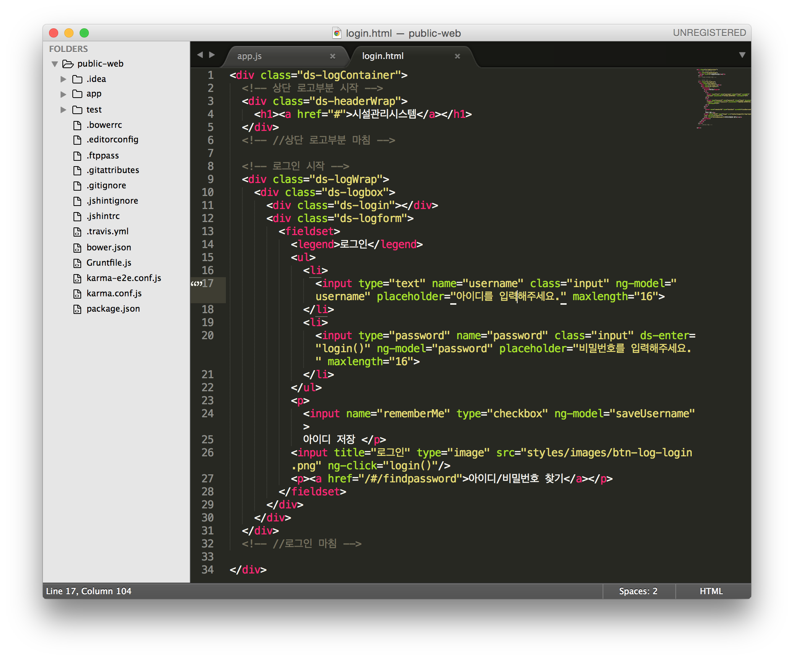

# Sublime 기능

사이트 : http://www.sublimetext.com/

## 패키지 설치

메뉴 View > Show Console 을 선택해서 Console 창을 열고 아래의 명령어를 입력하고 엔터 입력하세요.

Sublime Text 2

```cmd
import urllib2,os; pf='Package Control.sublime-package'; ipp=sublime.installed_packages_path(); os.makedirs(ipp) if not os.path.exists(ipp) else None; urllib2.install_opener(urllib2.build_opener(urllib2.ProxyHandler())); open(os.path.join(ipp,pf),'wb').write(urllib2.urlopen('http://sublime.wbond.net/'+pf.replace(' ','%20')).read()); print('Please restart Sublime Text to finish installation')
```

Sublime Text 3

```cmd
import urllib.request,os,hashlib; h = '7183a2d3e96f11eeadd761d777e62404' + 'e330c659d4bb41d3bdf022e94cab3cd0'; pf = 'Package Control.sublime-package'; ipp = sublime.installed_packages_path(); urllib.request.install_opener( urllib.request.build_opener( urllib.request.ProxyHandler()) ); by = urllib.request.urlopen( 'http://sublime.wbond.net/' + pf.replace(' ', '%20')).read(); dh = hashlib.sha256(by).hexdigest(); print('Error validating download (got %s instead of %s), please try manual install' % (dh, h)) if dh != h else open(os.path.join( ipp, pf), 'wb' ).write(by)
```

패키지 명령

메뉴 Tools > Command Palette 를 선택 하거나 `shift+command+p` 를 사용하여 실행한다.

* Install Pacakge : 패키지를 설치하는 명령
* List Package : 설치된 패키지 목록을 보여준다.
* Remove Pacakage :  패키지를 삭제한다.


### 참고블로그

http://opentutorials.org/module/406/3629


## 명령어

### Column Selection (컬럼 선택)

컬럼 선택이란 선택의 범위를 세로로확장할 수 있는 서택을 의미하빈다. 우선 마우스와 단축키를 통해 같은 단어르르 선택하는 방법을 알아봅니다. 시작하는 곳을 클릭한다음에 Opt(윈 Shift)를 누르고 단어의 시작에서 마우스 오른쪽 버튼을 누르고 원하는 줄까지 드래그하면 됩니다.

`Opt + Mouse(Left button)`

이번에는 중간에 줄 선택을 제외하려면 Cmd(윈 Ctrl+Shift)를 누르고 마우스 오른쪽 버튼을 클릭해 단어의 앞을 클릭합니다.

`Cmd + Mouse(Left button)`

### Expand Selection(선택의 확장)


편집창내 같은 단어지만 마우스 더블클릭 또는 Shift+좌(우) 화살표방향 클릭하게 되면 마우스 대쉬로 분리된 단어가 선택된다 이때 Opt+D(윈 Ctrl+D)를 눌러서 선택된 단어를 확장한다.

### 로그 보기/감추기 기능

Sublime Console에 로그를 보이게 하거나 로그를 감추는 명령어
`view > show console`

```cmd
보이기
sublime.log_commands(True)
감추기
sublime.log_commands(False)
```

### 들여쓰기(Indent)

에디터 환경에서 들여쓰기 할곳에 블록을 설정하거나 문자 시작에 마우스 포커서를 두고 `Command+]` 하면 들여쓰기 `Command+[`하면 내여쓰기를 할 수 있습니다.


### 줄의 복사와 삭제 (Duplicate Line and Delete Line)

`Cmd+Shift+D(윈 Ctrl+Shift+D)` 줄의 복사, `Cmd+Shift+k(윈 Ctrl+Shift+K)` 줄의 삭제

### 줄의 병합하기 (Join Line)

`Cmd+j` 줄의 병합기능

### 주석기능

주석은 `Cmd+/`, 주석블록은 `Cmd+Opt+/`

### 빈줄 넣기

빈줄넣기 `Cmd+Return` 이전빈줄넣기 `Cmd+Shift+Return`

### 코드접기(Code Folding)

에디터 창의 태그코드의 블럭을 접는 기능을 제공합니다. 전체접기는 `Cmd+Opt+[` 사용하고 반대로 접기풀기는 `Cmd + Opt + ]`을 사용 하면됩니다.

그외 태그 레벨단위로 접기기능을 제공하는데 `Cmd+k, Cmd+숫자` 이때 숫자는 태그의 깊이를 의미합니다. 특정블록의 태그를 접는게 아니라 해당 깊이의 모든 태그를 접는 기능입니다. 반대로 해제시는 `Cmd+k, Cmd+j` 입니다.


## 플러그인 소개

### Emmet

Emmet은 간단한 글자 입력으로 복잡한 코드를 완성 할 수 있는 플러그인 입니다.
이전 이름이 Zen Coding 이었던 것이 Emmet으로 리네임 되면서 기능도 더 좋아 졌습니다.

Shift + Cmd (Window : Shift + Ctrl) 단축명령으로 Command Palette 을 오픈한 다음에 `Install Package`를 입력해서 플러그인 설치가능 리스트로 이동합니다. 이곳입력 명령창에 Emmet 이라고 입력하고 설치하면 Command Palette과  편집창에서 Emmet관련 명령어를 사용 할수 있습니다.

단축명령어 : http://docs.emmet.io/cheat-sheet/

사용법 cheet sheet를 입력한 다음에 탭키를 눌러줍니다.

cheet-sheet 예시
```html 
html:5 [탭]
```

입력후 탭을 클릭하면 아래와 같이 HTML5 관련 기본코드가 생성됩니다.
```html
<!DOCTYPE html>
<html lang="en">
<head>
	<meta charset="UTF-8">
	<title>Document</title>
</head>
<body>
	
</body>
</html>
```


### FTP연결하기

서브라임 텍스트는 호스팅 서버와 연결해 작업 할 수 있는 환경이 기본편집기에는 구비되어 있지 않습니다. `Install Package`를 통해 FTPSync를 설치합니다.

맥의 경우 메뉴중 Sublime Text > Preferences > Package Settings > FTPSync >  Settings User 를 선택하여 사용자 설정 파일을 오픈합니다.

Settings Defults에 있는 설정내용을 복사해서 사용자 설정 파일에 붙여 넣은 다음에 본인의 FTP서버 환경을 설정합니다.

```json
{
	"primary": {
    	"host":"remote server domain or ip",
		"username":"testuser",
        "password":"testpassword",
		"path":"/"
    }
}

```

### SideBarEnhancements

View > SideBar 클릭해면 외쪽에 사이드바가 생성되는데 이곳의 프로젝트 트리에서 폴더나 파일을 선택후 마우스 오측버튼을 클릭하면 메뉴가 나오는데 기능이 별로 없습니다. 그래서 개발된 것이 SideBarEnhancements 입니다.


### Color Picker (칼라 픽커)

### Minifier ( 코드축약 )

편집기 내에서 작성한 코드의 파일양을 줄이기 위해서 만들어진 패키지 입니다.
편집기에서 해당 코드에 블럭을 설정하고 우측마우스를 클릭하면 Minify 라는 메뉴명령어가 보입니다. 이를 클릭해주시면 해당 코드가 한줄로 작성됩니다. 이와 반대로 여러줄로 변경하려면 동일하게 블럭을 설정하고 우측마우스를 클릭 후 `HTML/CSS/JS Prettify`에서 `Prettify Code` 메뉴를 클릭하시면 여러라인의 코드로 복원 됩니다.

### BracketHighlighter

편집창에서 태그나 따옴표, 괄호를 잘 구분하기 어려울대 BracketHighlighter 패키지를 설치하면 이를 쉽게 구분할 수 있습니다.



### AutoPrefixr

CSS3의 속성에는 아직 웹 표준으로 승인되지 않은 태그들이 많아서 브라우저별 접두어를 붙여서 사용해야 하는데 이 모든 접두어를 일일이 복사해서 사용하기에는 매우 어렵습니다. 암기력이 무지 좋으면 가능하겠죠 !!!

패키지를 설치후 Cmd + Shfit + P를 누르면 커맨드창에 팔레트에서 autoprefix로 검색후 엔터 치면 적용됩니다.

## CanIuse

편집창에서 CSS속성에 커서를 배치한 다음 단축키인 `Ctrl + Alt + F` 누르면 웹 브라우저를 띄우고 CSS의 웹표준이 상태를 알 수 있습니다.


## CSSComb

스타일시트 코드를 보기 편하게 편집해 주는 CSS 편집툴입니다. 사용방법은 단축키 Ctrl + Shift + C 입니다.


